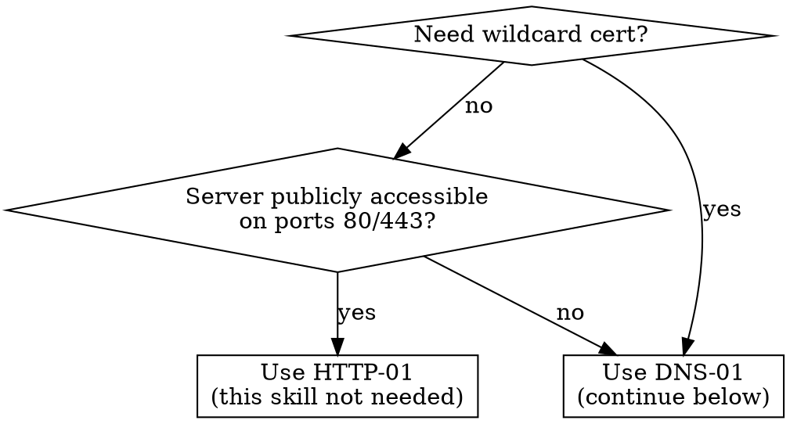

# RWTS ACME DNS — SSL Certificate Configuration

Configures SSL/TLS certificates using DNS-01 challenges via the RWTS ACME DNS infrastructure.

- **Base URL:** `https://acmedns.realworld.net.au`
- **User UI:** `https://acmedns.realworld.net.au` — **Admin UI:** `https://admin.acmedns.realworld.net.au`
- Both UIs require an API key. Mention these as alternatives if the user prefers a GUI workflow.

## DNS-01 vs HTTP-01 Pre-Check

If HTTP-01 suffices, recommend it and stop. DNS-01 is for when HTTP-01 won't work.

## Supported Platforms

Traefik, Certbot, acme.sh, Nginx Proxy Manager, Caddy, Apache, Proxmox, HAProxy

## Phase 1 — Assess

1. Ask the user what **domain(s)** to secure.
2. Ask which **platform** from the supported list above.
3. **API key check:**
   - **Has key** — verify with: `curl -s -H "X-API-Key: <key>" https://acmedns.realworld.net.au/api/info`
   - **No key + admin access** — create via: `curl -s -X POST -H "Authorization: Bearer <master-key>" -H "Content-Type: application/json" -d '{"name":"..."}' https://acmedns.realworld.net.au/api/admin/keys`
   - **No key + no admin** — tell user to contact an RWTS admin for an API key.
4. **Check if domain already registered:** `curl -s -X POST -H "X-API-Key: <key>" -H "Content-Type: application/json" -d '{"domain":"<domain>"}' https://acmedns.realworld.net.au/api/lookup`
   - **Found** — ask if user has the acme-dns credentials (username/password) from original registration. The `/lookup` endpoint does NOT return these. If they have credentials, skip to Phase 3. If not, re-register (Phase 2).
   - **Not found (404)** — proceed to Phase 2.

Propose every curl command and wait for user confirmation before executing.

## Phase 2 — Register

For multi-domain or SAN certs, repeat for each domain.

1. Propose: `curl -s -X POST -H "X-API-Key: <key>" -H "Content-Type: application/json" -d '{"domain":"<domain>"}' https://acmedns.realworld.net.au/api/register`
2. Capture the response: `subdomain`, `username`, `password`, `fulldomain`.
3. **CRITICAL WARNING:** Tell user to save these credentials securely — they are returned **only once** and cannot be retrieved later.
4. Present the CNAME record: `_acme-challenge.<domain> CNAME <subdomain>.acmedns.realworld.net.au`
   - For wildcard `*.example.com`, the CNAME goes on `_acme-challenge.example.com` (the base domain).
5. Guide DNS setup — if user needs help, `Read` the file `reference/dns-setup.md` from this skill directory.
6. Optionally verify propagation: `dig CNAME _acme-challenge.<domain>`

## Phase 3 — Configure

**CRITICAL:** ACME clients must use `https://acmedns.realworld.net.au` as their server URL (root path). The `/update` endpoint is at the root, NOT under `/api/`. Getting this wrong causes silent failures.

**Internal domains and DNS resolvers:** When securing internal or private domains, the local DNS resolver often cannot resolve the `_acme-challenge` CNAME or the acme-dns TXT records — these only exist in public DNS. Configure the ACME client to use external resolvers (e.g. `1.1.1.1:53`, `8.8.8.8:53`) for DNS propagation checks. Without this, the client may report that propagation failed even though the records are correct on the public internet. Each platform reference includes resolver configuration where supported.

1. `Read` the platform reference file at `~/.claude/skills/acmedns/reference/platforms/<platform>.md`.
2. Replace template variables with real registration data:
   - `{{DOMAIN}}` — the domain
   - `{{SUBDOMAIN}}` — subdomain from registration
   - `{{USERNAME}}` — username from registration
   - `{{PASSWORD}}` — password from registration
   - `{{FULLDOMAIN}}` — `<subdomain>.acmedns.realworld.net.au`
3. Present the configuration with explanation.
4. Offer to write config files into the user's project (propose file paths and content, wait for confirmation).

## Error Handling

- Check `/api/health` at workflow start — if unhealthy, inform user and stop.
- **429 (rate limited)** — tell user which limit was hit and to wait.
- **401/403 (auth failure)** — re-check API key; it may be expired or revoked.
- **Registration failure** — show error response, suggest `Read`ing `reference/api.md` for details.

## Confirmation Gate Rules

- **Every** API call must be proposed with the full curl command before execution.
- Wait for user approval before running.
- User can always choose to run commands themselves.
- Never store or log API keys in files without explicit consent.
